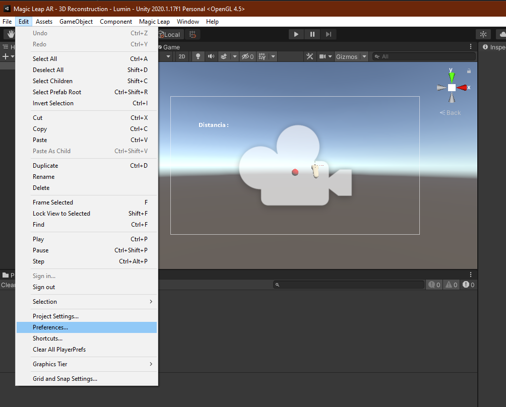
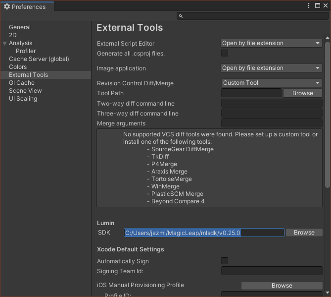
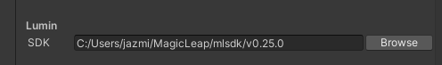
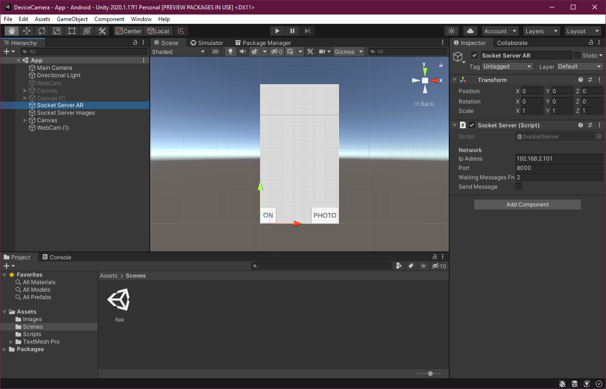
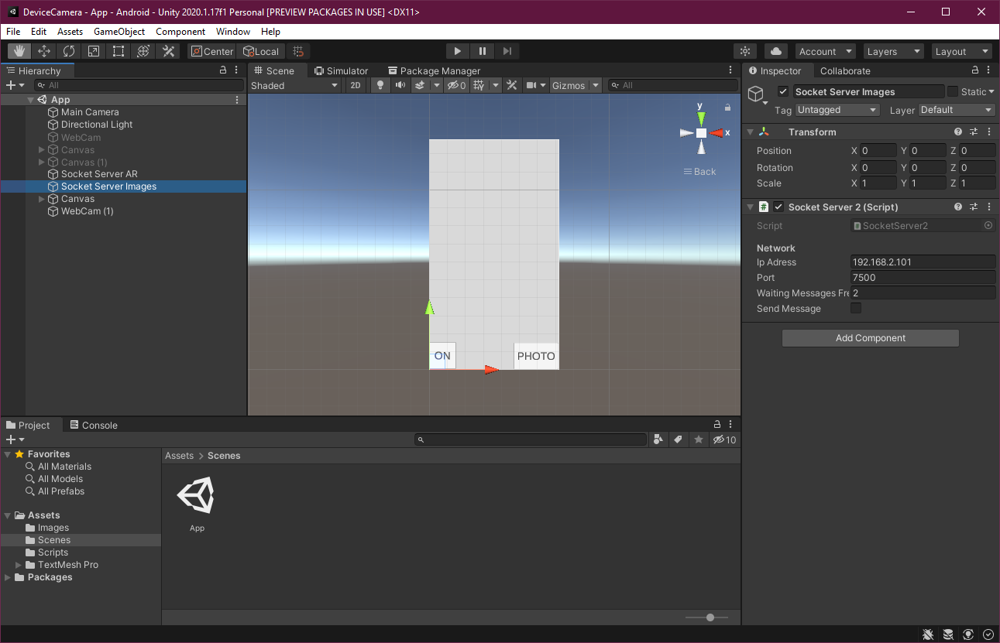
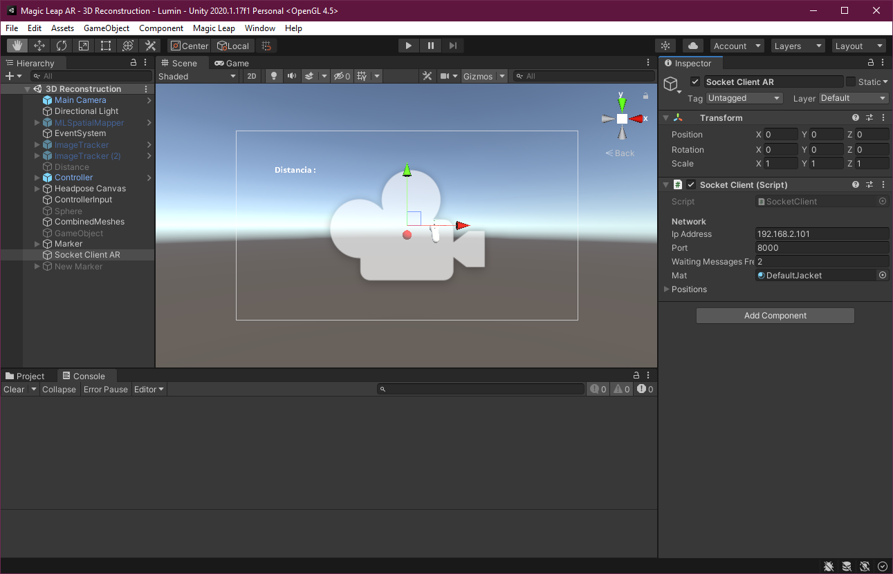
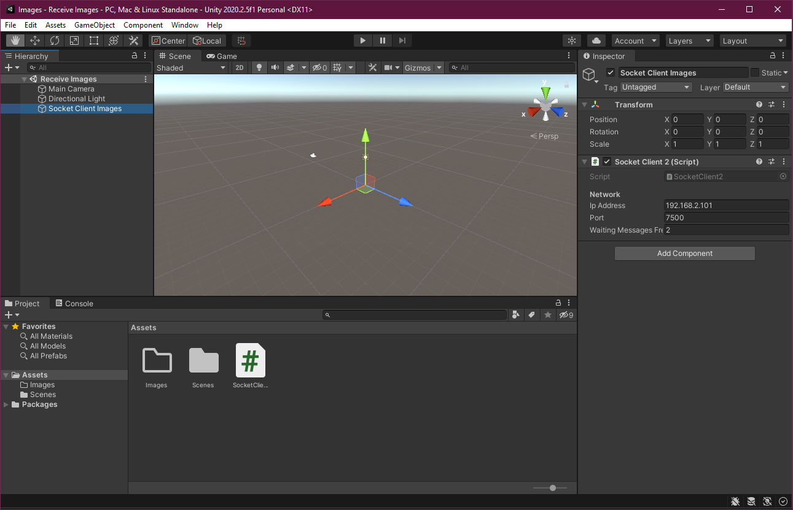

# PFC3

# Índice
- [1. Configuración del proyecto](#1-configuración-del-proyecto)
  - [Establecer la ruta al Lumin SDK](###establecer-la-ruta-al-lumin-sdk)
  
- [2. Descripción de los programas y la aplicación](#2-descripción-de-los-programas-y-la-aplicación)
- [3. Comunicación entre los programas y la aplicación](#3-comunicación-entre-los-programas-y-la-aplicación)

# 1 Configuración del proyecto
### Establecer la ruta al Lumin SDK
1. Ir a Editar> Preferencias (Windows) o Unity> Preferencias (macOS). Se abre el cuadro de diálogo Preferencias.

2. En el cuadro de diálogo Preferencias, haga clic en Herramientas externas.

3. En Herramientas externas para Lumin SDK, haga clic en Examinar y luego navegue y seleccione la carpeta de la versión de Lumin SDK, por ejemplo C:/Users/jazmi/MagicLeap/mlsdk/v0.25.0.

Para mayor información acceder al siguiente enlace:

https://developer.magicleap.com/en-us/learn/guides/manual-unity-project-setup-0-24-1

# 2 Descripción de los programas y la aplicación

### DeviceCamera

Esta aplicación se utilizará en un celular para capturar las imágenes necesarias para la reconstrucción 3D. 
Se conecta con dos programas : Magic Leap AR e Images.

### Magic Leap AR

Este programa se utilizará en los lentes de RA Magic Leap que brindarán la guía para que el usuario capture las imágenes en la posición e inclinación adecuada.
Se conecta con la aplicación DeviceCamera, para conocer la posición en la que se encuentra el celular dentro de la escena y generar un rastro.
  

### Images

Este programa se utilizará en una computadora para recibir las imágenes necesarias para la reconstrucción 3D.
Se conecta con la aplicación DeviceCamera. 

# 3 Comunicación entre los programas y la aplicación:

La aplicación DeviceCamera es el servidor que se encarga de enviar las imágenes (Images) y si se tomó una foto para colocar el rastro en la escena (Magic Leap AR), ambos clientes.
Los programas y la aplicación se comunicarán a través del protocolo TCP que requerirá que se definan las IPs y los puertos a utilizar.
Como los programas y la aplicación se ejecutaron en la misma computadora, todos tienen la misma dirección IP y lo que cambia es el puerto, pero esto se puede modificar al tener los programas en diferentes dispositivos conectados a la misma red. 

### DeviceCamera
Las IPs y los puertos a cambiar se ven en las siguientes imágenes.

GameObject Socket Server AR: Este se comunica con el programa Magic Leap AR, con el GameObject Socket Client AR.

GameObject Socket Server Images: Este se comunica con el programa Images, con el GameObject Socket Client Images.

### Magic Leap AR

GameObject Socket Client AR: Este se comunica con el programa DeviceCamera, con el GameObject Socket Server AR.

### Images

GameObject Socket Client Images: Este se comunica con el programa DeviceCamera, con el GameObject Socket Server Images.

